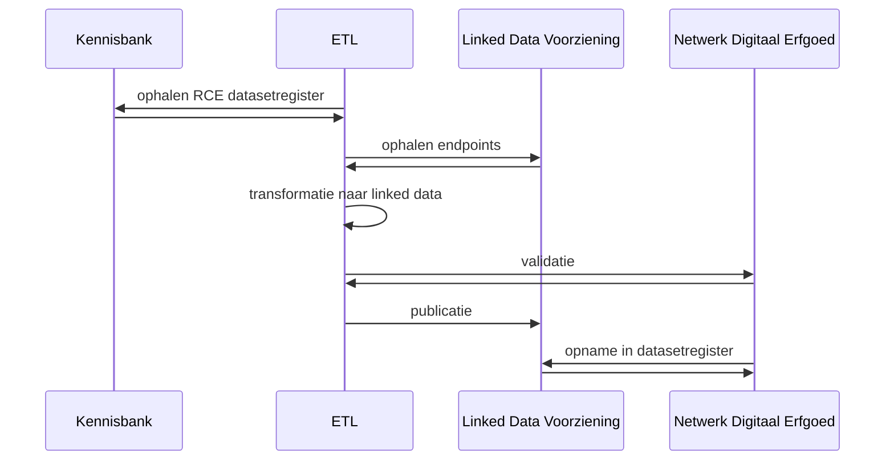

# ETL voor het publiceren van RCE datasets op het NDE Datasetregister

Deze ETL voert de volgende stappen uit:
1. Haalt de lijst van datasets op die gepubliceerd zijn op de Kennisbank van de Rijksdienst voor Cultureel Erfgoed.
2. Haalt de lijst van gepubliceerde endpoints op van de Linked Data Voorziening van de RCE.
3. Transformeert de metadata over de datasets naar schema.org volgens de richtlijn van het NDE Datasetregister, en filtert de datasets die hier niet aan voldoen er uit.
4. Valideert de transformatie via de validatie API van het Netwerk Digitaal Erfgoed.
5. Publiceert de set van datasets op [linkedata.cultureelerfgoed.nl](https://linkeddata.cultureelerfgoed.nl/rce/datacatalog-rce/).
6. De data wordt opgehaald en opgenomen in het NDE Datasetregister. 

## Sequentiediagram ETL


# Installatie

```
python -m venv .venv
source .venv/Scripts/activate
pip install -r requirements.txt
```


# How to run

```
python src/generate_allowlist.py
python src/datacatalog_service.py
python src/validator.py
```

<!--
#### Endpoint voor validatie van NDE
```https://datasetregister.netwerkdigitaalerfgoed.nl/api/#/default/validate-body```
#### Endpoint Kennisbank RDF export
```https://kennis.cultureelerfgoed.nl/index.php/Speciaal:Vragen/format%3Drdf/limit%3D20/link%3Dall/headers%3Dshow/searchlabel%3DRDF/class%3Dsortable-20wikitable-20smwtable/prefix%3Dnone/sort%3D/order%3Dasc/offset%3D0/-5B-5BCategorie:Datasets-5D-5D/mainlabel%3D/prettyprint%3Dtrue/unescape%3Dtrue```
-->