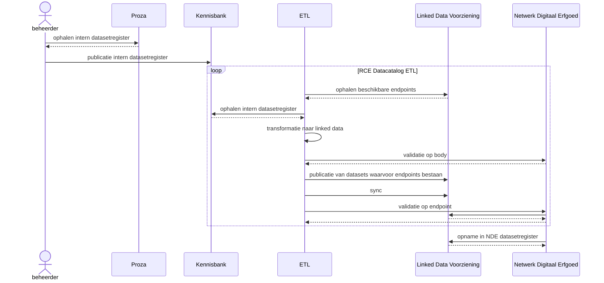

# ETL voor het publiceren van RCE datasets op het NDE Datasetregister


```mermaid
flowchart LR;
    Proza(Proza) --> KB(Kennisbank) --> ETL(ETL) --> LDV(Linked Data Voorziening) --> NDE(NDE Datasetregister)
```

Deze ETL voert de volgende stappen uit:
1. Haalt de lijst van datasets op die gepubliceerd zijn op de Kennisbank van de Rijksdienst voor Cultureel Erfgoed.
2. Haalt de lijst van gepubliceerde endpoints op van de Linked Data Voorziening van de RCE.
3. Transformeert de metadata over de datasets naar schema.org volgens de richtlijn van het NDE Datasetregister, en filtert de datasets die hier niet aan voldoen er uit.
4. Valideert de transformatie via de validatie API van het Netwerk Digitaal Erfgoed.
5. Publiceert de set van datasets op [linkeddata.cultureelerfgoed.nl](https://linkeddata.cultureelerfgoed.nl/rce/datacatalog-rce/).
6. De data wordt opgehaald en opgenomen in het NDE Datasetregister. 

## Sequentiediagram ETL

```mermaid
sequenceDiagram;
    actor beheerder
    participant Proza 
    participant Kennisbank
    participant ETL
    participant Linked Data Voorziening
    participant Netwerk Digitaal Erfgoed
    
    beheerder->>Proza:ophalen intern datasetregister
    Proza-->>beheerder:
    beheerder->>Kennisbank:publicatie intern datasetregister
    loop RCE Datacatalog ETL
        ETL->>Linked Data Voorziening:ophalen beschikbare endpoints
        Linked Data Voorziening-->>ETL:
        ETL->>Kennisbank:ophalen intern datasetregister
        Kennisbank-->>ETL:
        ETL->>ETL:transformatie naar linked data
        ETL->>Netwerk Digitaal Erfgoed:validatie op body
        Netwerk Digitaal Erfgoed-->>ETL:
        ETL->>Linked Data Voorziening:publicatie van datasets waarvoor endpoints bestaan
        ETL->>Linked Data Voorziening:sync
        ETL->>Netwerk Digitaal Erfgoed:validatie op endpoint
        Netwerk Digitaal Erfgoed->>Linked Data Voorziening:
        Linked Data Voorziening-->>Netwerk Digitaal Erfgoed:
        Netwerk Digitaal Erfgoed-->>ETL:
    end
    Netwerk Digitaal Erfgoed->>Linked Data Voorziening:opname in NDE datasetregister
    Linked Data Voorziening-->>Netwerk Digitaal Erfgoed:
```

# Installatie

```
python -m venv .venv
source .venv/Scripts/activate
pip install -r requirements.txt
```

# Uitvoeren

```
python src/generate_allowlist.py
python src/datacatalog_service.py
python src/validator.py --path 'artifact-data.jsonld' --method 'GET' --status 200
```
# Configureren

De configuratiewaardes van de workflow kunnen aangepast worden in het bestand config/config.yml. Zie config/config.yml voor uitgebreidere documentatie over de mogelijkheden. Verdere configuratie staat in de workflow bestanden in .github/workflows/.
