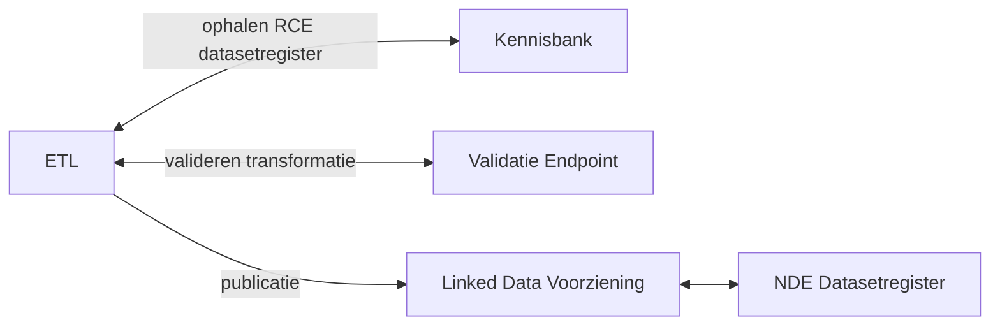

# ETL voor het publiceren van RCE datasets op het NDE Datasetregister

Deze ETL voert de volgende stappen uit:
1. Haalt de lijst van datasets op die gepubliceerd zijn op de Kennisbank van de RCE
2. Transformeert de metadata over de datasets naar schema.org volgens de richtlijn van het NDE Datasetregister, en filtert de datasets die hier niet aan voldoen er uit.
3. Valideert de transformatie via de validatie API van het NDE.
4. Publiceert de set van datasets op [linkedata.cultureelerfgoed.nl](https://linkeddata.cultureelerfgoed.nl/rce/datacatalog-rce/).


# Installatie

```
python -m venv .venv
source .venv/Scripts/activate
pip install -r requirements.txt
```

# How to run

```
python src/generate_allowlist.py
python src/datacatalog_service.py
python src/validator.py
```

#### Endpoint voor het ophalen van createdAt, updatedAt en license van de LDV.
```https://api.linkeddata.cultureelerfgoed.nl/datasets/rce/```
#### Endpoint voor validatie van NDE
```https://datasetregister.netwerkdigitaalerfgoed.nl/api/#/default/validate-body```
